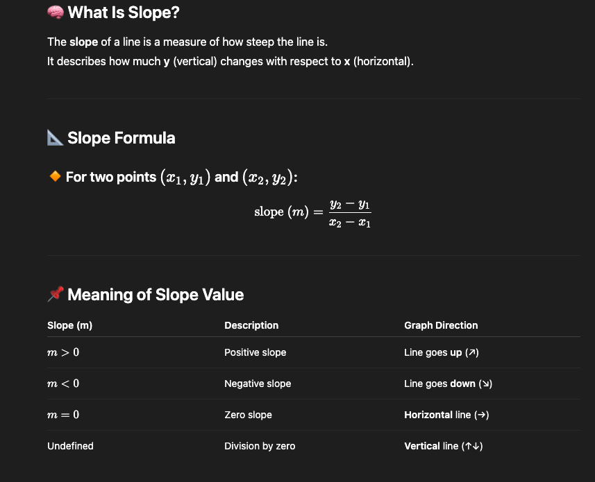
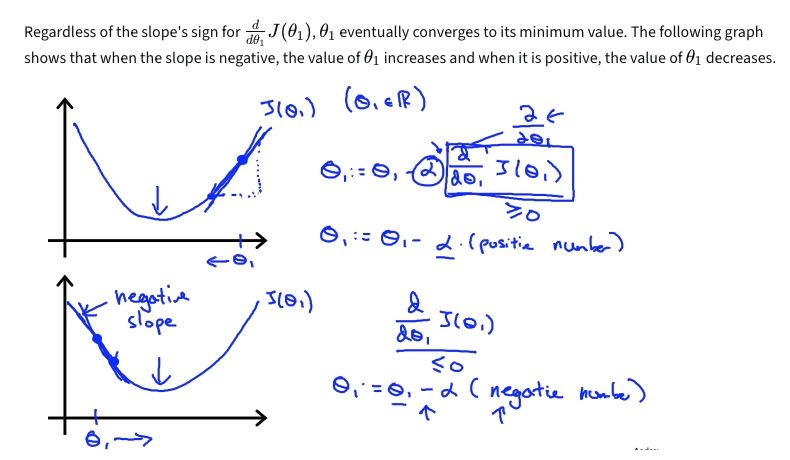

An Artificial Neural Network (ANN) is a machine learning model inspired by the structure and function of the human brain.
It is especially powerful for:
    1. Classification
    2. Regression
    3. Image and speech recognition
    4. Natural language processing (NLP)

ANN Structure
    1. At its core, an ANN is composed of layers of neurons:
        1. Input Layer
            a. Accepts the raw input data (e.g., features like age, height, word embeddings).
            b. One neuron per feature.

        2. Hidden Layer(s)
            a. Where most of the computation happens.
            b. Neurons apply weights, biases, and activation functions.
            c. Can have 1 to many hidden layers (more layers = deeper network = DNN).

        3. Output Layer
            a. Produces the final prediction/output.
            b. Classification → Softmax or Sigmoid (Activation functions)
            c. Regression → Linear activation

Loss Function: Measures how far is the predicted output (y^) from the actual output (y). It quantifies the error and helps model to improve the prediction through 
               back-propagation and gradient descent

Slope of a Line: 

    1. Gradient descent: 
        a. Algorithm to minimize the loss function: 
        

    2. Loss functions:
        1. For Regression:
            a. Mean Squared Error: Penalizes larger error (sensitive to outliers), smooths gradients
            b. Mean Absolute Error: Treats all errors Equally, Less sensitive to outliers
            c. Huber Loss
        2. Classification:
            a. Cross Entropy Loss (Log Loss)
            b. Hinge Loss (for SVM)
