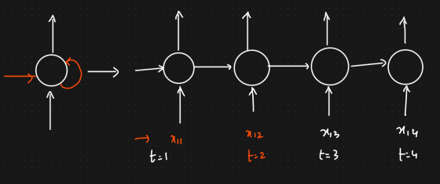
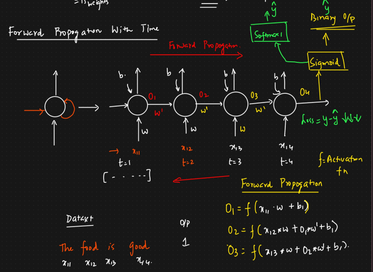

Difference between ANN, CNN and RNN:

1. ANN:
    a. Solves Classification and Regression Problems -> 1 Dimensional I/P data (Numbers, Matrix, Vectors)
    b. Structure: I/P Layer -> Hidden Layers -> O/P Layer
    c. Hidden layer is associated with weights and neurons -> Every neuron in one layer is connected to every neuron in the next
    d. O/P layer is associated with activation function
    e. We use loss function to determine the error and update the weights to reduce the loss using an Optimizer (Gradient Descent) -> Back Propagation
    f. Sequence of features will not impact the model training. All the I/P data is feed at a single go in forward propagation

2. CNN:
   1. Solves Image Classification Problems, Object Detection, Face Recognition, Speech -> 3-D or 4-D I/P data (Images, Videos)
   2. In image processing, convolution (mathematical way of combining 2 functions to produce a third function) is used to extract features (like edges, corners, textures) from images by sliding a small matrix (called a filter or kernel) over the image
   3. Structure: I?P layer → [Convolutional Layer → Dimensionality Reduction Layer] → Fully Connected Layer (Hidden Layers) → Output
   4. O/P layer is associated with activation function
   5. We use loss function to determine the error and update the weights to reduce the loss using an Optimizer (Gradient Descent) -> Back Propagation
   6. The relative positions of pixels (left, right, up, down) are crucial.But CNNs don't care about left-to-right sequence like RNNs or Transformers

3. RNN: Recurrent Neural Network
   1. Used for Sequential data (text, time series prediction)
   2. Similar Structure as ANN: I/P Layer -> Hidden Layers -> O/P Layer. However, in the hidden layer each neuron is connected all the other neuron to understand the sequence and the context in the input data
   3. Diagram:  -> Each word is passed at a different timestamp and all the neurons have the context of the earlier word passed
   4. Forward propagation: 
