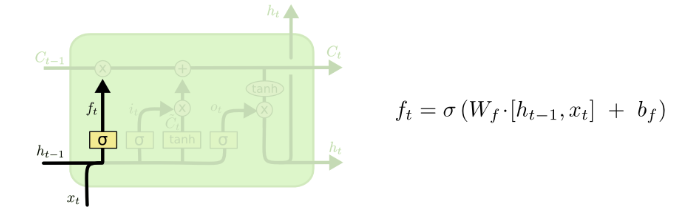
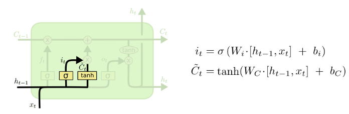
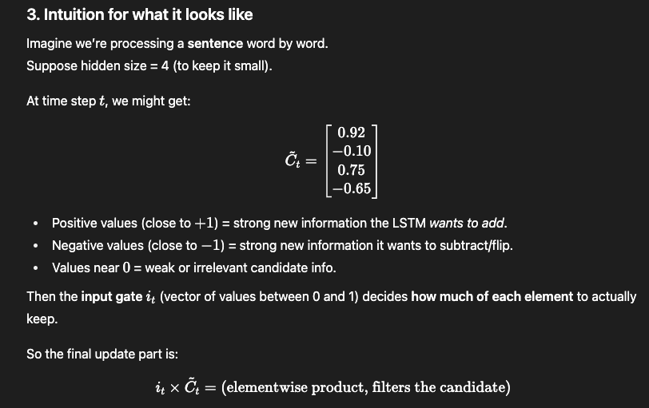
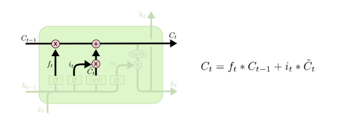
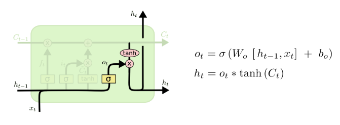

# LSTM Vs RNN

RNN: A person remembering what they read last sentence in a book, but forgetting after a few sentences
LSTM: A person with a notebook (cell state) where they write important info, and carefully decide what to keep, add, or use when reading the book

Gates in LSTM:
    1. Forget gate: Decides what past information to throw away
    2. Input gate: Decides what new information to add
    3. Output gate: Decides what part of the cell state to output

LSTM Networks: https://colah.github.io/posts/2015-08-Understanding-LSTMs/

1. LSTM was invented to remember information for a long time while still focusing on recent information
2. LSTM introduces a memory cell (like a conveyor belt) that carries information across time steps.
    At each step, it decides: It does this using gates
    1. What to keep
    2. What to update
    3. What to throw away

3. LSTM working:
   1. Each any Neural Network, each input neuron is connected to all the neurons in the hidden layer. So, even in LSTM-RNN at t = 1, the values passed as input (a vector representation of the first work in the corpus) will be sent to all the neurons in the hidden layer. Now as the core concept of RNN, each neuron in the hidden layer will be connected with the next neuron to maintain the sequential information, the output of each neuron in the hidden layer will be dependent on the current input, value shared from the initial neuron, and now in case of LSTM, along with the current input, value shared from the initial neuron we will also have the input from the Cell State which will bring the long term memory.
   2. At each time step (say, each word in a sentence):
      1. The LSTM looks at the current input and previous hidden state
      2. Gates decide what to forget, what new info to add, and what to output
      3. The cell state carries forward the long-term memory
      4. The hidden state is the short-term, immediate output
   3. $C_t$ is the cell state - the memory of the LSTM at time step 't'
      1. Unlike the hidden state $h_t$ (which is like short-term “working memory”), $C_t$ is designed to flow almost unchanged across many time steps so the network doesn’t forget important context
      2. Analogy:
         1. $C_t$ = Your running understanding of the whole plot so far (long-term memory).
         2. $h_t$ = What you’d summarize if someone asked you right now “what’s happening in this chapter?”
      3. So now at input 't', we have following parameters available:
         1. $x_t$ which is the input value at time 't'
         2. $h_{t-1}$ which is the previous hidden state output (short term memory - working memory)
         3. Thus we can now calculate $f_t$ (forget gate layer) -> Based on $x_t$ and $h_{t-1}$, it decides what to throw away from the previous cell state $C_{t-1}$: 
            1. The value is between 0 and 1: 1- “completely keep this” while a 0 - “completely get rid of this
            2. This value is calculate for each number in $C_{t-1}$ (This is a vector [no of neurons in hidden layer x 1] - Pandas series) - So for each value there will be a value between 0 - 1
            3. E.g: Language model trying to predict the next word based on all the previous ones. In such a problem, the cell state might include the gender of the present subject, so that the correct pronouns can be used. When we see a new subject, we want to forget the gender of the old subject
         4. The next step is to decide what new information we’re going to store in the cell state at time step 't' - Update the previous cell state $C_{t-1}$. This is done in 2 parts: 
            1. Input Gate Layer: Based on the input $x_t$, it decides which values to update - decide how much of the new candidate memory $\tilde{C}_t$ should be added to the cell state $C_t$
            2. tanh layer: Creates a vector of new candidate values $\tilde{C}_t$ (Candidate Cell State). The input gate $i_t$ decides how much of this candidate should actually be added
            3. In the example of our language model, we’d want to add the gender of the new subject to the cell state, to replace the old one we’re forgetting
            4. A element wise product is calculate of $i_t$ and $\tilde{C}_t$: 
         5. Update the Cell State $C_{t-1}$ to $C_t$ at time step 't':
            1. We have the following values to calculate the $C_t$:
               1. $f_t$: Vector of values between 0 and 1
                  1. size: [hidden size of LSTM x 1]
               2. $C_{t-1}$: Vector for the previous Cell State of size
                  1. Each element of the vector represents the “memory” of one hidden unit
                  2. [hidden size of LSTM x 1]
               3. $i_t$: Vector formed based on $x_t$ and $h_{t-1}
                  1. Think of it as a filter: for each hidden unit, it outputs a value between 0 (ignore completely) and 1 (accept fully)
                  2. We perform element wise multiplication with $\tilde{C}_t do determine how much of each of the new candidate values should be considered while updating the current Cell State
               4. Here $\tilde{C}_t$: Vector of new candidate values based on the current input $x_t$ and $h_{t-1}$
            2. All the above 4 values are vectors of size: [no of neurons in hidden layer x 1]
            3. Finally to update the old Cell state from $C_{t-1}$ to $C_t$:
               1. Multiple $C_{t-1}$ with $f_t$: This basically forgets the information that no more relevant based on the current input $x_t$ and previous stage $h_{t-1}$
               2. Multiple $i_t$ with $\tilde{C}_t$: This decides what values are required to be updated in the Cell State vector based on the current input value $x_t$ and previous stage $h_{t-1}$
               3. Finally we add the element wise product: $C_t$ = $f_t$ * $C_{t-1}$ + $i_t$ * $\tilde{C}_t$: 

   4. What is $h_t$:
      1. It is is the hidden state (also called the output) of the LSTM at time step 't'
      2. It represents the short-term memory — what the LSTM “outputs” at this time step
      3. Unlike the cell state $C_t$, which carries long-term memory, $h_t$ is what is visible to the next layer or used for prediction
      4. At each step, we have 2 outputs, $C_t$ (long term memory) and $h_t$ (short term memory)

   5. What exactly is the operation [$h_{t-1}$, $x_t$]:
      1. This is concatenation of 2 vectors
      2. We stack one vector below the other vector forming 1 long vector of dimension: [hidden size of LSTM + input dimension x 1]
      3. Why we concatenate:
         1. The forget gate (or any LSTM gate) needs both the previous hidden state (what the LSTM remembers) and the current input (new information) to decide what to forget, add, or output
         2. Concatenation lets us treat both vectors together as a single input for the weight matrix 'W'

   6. All the multiplications in LSTM is a element wise multiplication:
      1. For element wise multiplication we need to have the same size of the vectors
      2. Each vector in this case is a concatenated vector of the same size

   7. Now we need to finally calculate the outputs $C_t$ and $h_t$ for a cell at time step 't' (for the given neuron/ cell):
      1. We have already calculated the $C_t$
      2. Now We have to calculate the values for $h_t$, where we have following values at hand:
         1. Current Cell State: $C_t$
         2. Current input: $x_t$
         3. Previous hidden state output: $h_{t-1}$
         4. Now we have 2 steps:
            1. Pass the $x_t$ and $h_{t-1}$ through sigmoid to calculate $o_t$: By passing the concatenated through the sigmoid function, we convert all the values between 0 and 1 which allows to decide what part of vector we are going to output
            2. Multiply $o_t$ with tanh($C_t$): $o_t$ will be a value between 0 and 1 and tanh($C_t$) will be a value between -1 and 1
            3. Image: 

   8. List of terminologies in LSTM:
      1. Input at state 't': $x_t$
      2. Output from previous state: $h_{t-1}$
      3. Previous Cell state: $C_{t-1}$
      4. forget gate layer: $f_t$ = $\sigma$($W_f$ * [$h_{t-1}$, $x_t$] + $b_f$)
      5. input gate layer: $i_t$ = $\sigma$($W_i$ * [$h_{t-1}$, $x_t$] + $b_i$)
      6. tanh layer (new candidate cell state): $\tilde{C}_t$ = tanh($W_c$ * [$h_{t-1}$, $x_t$] + + $b_c$)
      7. Output gate: $o_t$ = $\sigma$($W_o$ * [$h_{t-1}$, $x_t$] + $b_o$) 
      8. Output: $o_t$ * tanh($C_t$)
   9. $h_t$ at each step is a vector which encodes what the model understood about the sentence up to stage 't'. This is compressed knowledge of all the past trends up to time 't' which is revealed by LSTM at that point of time